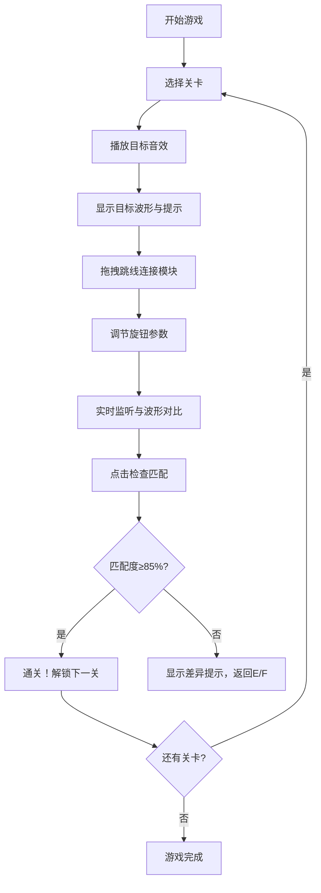

## 1. 产品概述

一款模拟70年代模块化合成器的网页沙盒游戏，玩家通过跳线连接VCO、VCF、VCA、LFO等真实音频模块，并调节旋钮参数，重现目标音效的波形与音色。

- 面向电子音乐爱好者、复古游戏玩家、音频编程初学者
- 提供沉浸式的复古硬件交互体验，寓教于乐地学习合成器原理

## 2. 核心功能

### 2.1 功能模块

1. **合成器主面板**：金属拉丝风格的巨型机器面板，包含多个音频模块
2. **音频模块库**：VCO（压控振荡器）、VCF（压控滤波器）、VCA（压控放大器）、LFO（低频振荡器）
3. **虚拟连线系统**：从输出插孔拖拽信号线到输入插孔，实时建立音频路由
4. **示波器显示**：实时显示当前输出波形与目标波形的叠加对比
5. **关卡系统**：多关卡递进，每关播放目标音效并给出匹配度评分
6. **参数调节**：每个模块配有可旋转的物理旋钮，调节频率、共振、增益等参数

### 2.2 页面详情

| 页面名称 | 模块名称 | 功能描述 |
|-----------|-------------|---------------------|
| 主游戏页 | 标题栏 | 显示游戏Logo、当前关卡、匹配度百分比、菜单按钮 |
| 主游戏页 | 合成器面板 | 金属拉丝背景，排布VCO/VCF/VCA/LFO等模块 |
| 主游戏页 | 模块单元 | 每个模块包含模块名称、指示灯、多个旋钮、输入/输出插孔 |
| 主游戏页 | 连线画布 | SVG层覆盖整个面板，渲染彩色音频线和连接动画 |
| 主游戏页 | 示波器区域 | 双波形Canvas（当前波形+目标波形），频谱辅助显示 |
| 主游戏页 | 控制面板 | 播放目标声音、重置连线、检查匹配、下一关按钮 |
| 关卡选择页 | 关卡卡片 | 展示所有关卡缩略图、难度星级、通关状态 |
| 关卡选择页 | 进度条 | 显示总体通关进度 |

## 3. 核心流程

玩家进入游戏 → 选择关卡 → 播放目标音效并显示目标波形 → 拖拽连线建立模块路由 → 旋转旋钮调节参数 → 实时监听声音与波形 → 点击「检查匹配」→ 根据波形相似度与频谱特征评分 → 达到阈值则通关，可进入下一关。

## 4. 用户界面设计

### 4.1 设计风格

- **主色调**：深炭灰色金属面板 `#2a2a2e`，配以古铜色镶边 `#8b6914`，指示灯霓虹色（红 `#ff3b30`、绿 `#34c759`、黄 `#ffcc00`）
- **旋钮样式**：3D立体拟真旋钮，金属银色外环 + 黑色磨砂内盘 + 白色刻度指针，有旋转阴影动画
- **连线颜色**：红、黄、蓝、绿、紫、橙六色随机分配，带光泽高光和弯曲物理效果
- **字体**：标题使用复古工业风字体「Bebas Neue」，旋钮标签使用「Share Tech Mono」等宽字体，信息文本使用「Roboto Condensed」
- **布局风格**：拟物化机架式布局，模块以螺丝固定的金属盒排列，整体呈19英寸标准合成器机架视觉
- **质感细节**：背景添加拉丝噪点纹理、螺丝高光、模块阴影堆叠、旋钮鼠标悬停光晕、插孔金属圆环反光

### 4.2 页面设计概览

| 页面名称 | 模块名称 | UI 元素 |
|-----------|-------------|-------------|
| 主游戏页 | 合成器面板 | 1400px宽金属拉丝背景，顶部古铜色Logo条，4行×3列模块栅格，每模块5mm黑色边框+4角螺丝装饰 |
| 主游戏页 | VCO模块 | 2个旋钮（波形选择、频率），波形切换按钮组（正弦/方波/锯齿），1个输出插孔（OUT），2个输入插孔（FM IN、PWM IN） |
| 主游戏页 | VCF模块 | 3个旋钮（截止频率、共振Q、滤波类型），1个输入插孔（IN），1个输出插孔（OUT），1个CV输入孔 |
| 主游戏页 | VCA模块 | 2个旋钮（初始增益、调制量），1个音频输入（IN），1个CV输入，1个输出（OUT） |
| 主游戏页 | LFO模块 | 2个旋钮（频率、深度），波形选择按钮，1个输出（OUT） |
| 主游戏页 | 连线系统 | SVG贝塞尔曲线，起点为输出插孔中心，终点为输入插孔中心，线宽4px，渐变描边，拖拽时半透明预览线 |
| 主游戏页 | 示波器 | 黑底绿荧光CRT风格，网格线半透明，目标波形用灰色虚线，当前波形用亮绿色实线，边角有CRT辉光效果 |

### 4.3 响应式设计

- 桌面端优先设计，最小支持宽度 1280px
- 面板模块使用固定栅格，不做流式缩放，保持拟真比例
- 小屏设备显示「请使用桌面设备获得最佳体验」提示

### 4.4 交互动效

- 旋钮：鼠标按下并左右/上下拖拽旋转，旋转时有刻度咔哒感（离散值）和轻微缩放反馈
- 连线：从输出孔拖拽时生成弹性贝塞尔线，跟随鼠标运动，插入孔时有「咔哒」吸附动画
- 匹配度：检查匹配时匹配度数字有数字滚动动画，示波器边缘根据匹配度脉冲红光或绿光
- 通关：模块指示灯全闪绿色，连线发出流动光效，播放胜利音效
