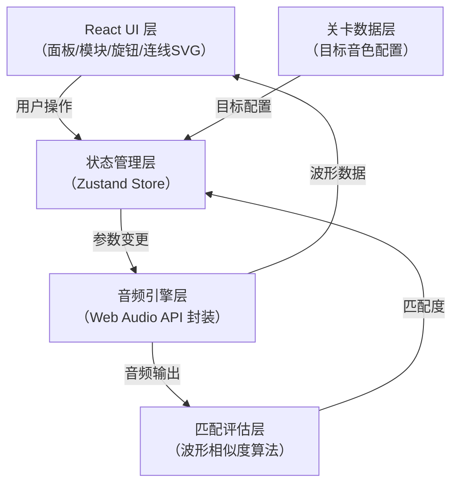

## 1. 架构设计



## 2. 技术说明

- **前端框架**：React@18 + TypeScript + Vite@6
- **样式方案**：TailwindCSS@4 + 自定义CSS（拟物化阴影、金属纹理、3D旋钮）
- **状态管理**：Zustand（轻量级，适合频繁旋钮/连线状态更新）
- **音频技术**：原生 Web Audio API（OscillatorNode / BiquadFilterNode / GainNode / AnalyserNode / WaveShaperNode）
- **连线渲染**：原生 SVG（贝塞尔曲线路径、拖拽交互）
- **波形可视化**：HTML Canvas 2D（requestAnimationFrame + AnalyserNode.getByteTimeDomainData）
- **图标方案**：Lucide React（简洁线性图标，用于菜单按钮等UI元素）
- **匹配算法**：FFT频谱特征余弦相似度 + 时域波形均方误差(MSE) 加权评分

## 3. 核心技术实现

### 3.1 路由定义

| 路由 | 用途 |
|-------|---------|
| / | 首页（关卡选择 + 开始游戏入口） |
| /play/:levelId | 游戏主面板（指定关卡） |

### 3.2 Web Audio 节点映射

| 模块名 | 内部 Web Audio 节点 | 参数映射 |
|-------|---------------------|---------|
| VCO | OscillatorNode + GainNode(输出) | waveform → type, frequency → frequency.value, FM_IN → frequency AudioParam, PWM_OUT → periodic wave |
| VCF | BiquadFilterNode | filterType → type, cutoff → frequency.value, resonance → Q.value, CV_IN → frequency AudioParam |
| VCA | GainNode(2个级联) | initialGain → gain.value, CV输入连接到 modulation Gain |
| LFO | OscillatorNode(低频) + GainNode(深度) | rate → frequency.value, depth → gain.value, 输出可连接到任意AudioParam |
| OUTPUT | GainNode(主音量) + AnalyserNode(×2: 时域+频域) + Destination | master → gain.value |

### 3.3 连线数据模型

```typescript
type JackType = 'audio_out' | 'audio_in' | 'cv_out' | 'cv_in';
type ModuleId = 'vco1' | 'vco2' | 'vcf' | 'vca' | 'lfo1' | 'lfo2' | 'output';

interface Jack {
  id: string;
  moduleId: ModuleId;
  name: string;        // e.g. 'OUT', 'FM_IN', 'CUTOFF_CV'
  type: JackType;
  node?: AudioNode;    // Web Audio 节点引用
  param?: AudioParam;  // 若为 CV 输入则为 AudioParam
}

interface Cable {
  id: string;
  from: string;  // Jack.id (输出)
  to: string;    // Jack.id (输入)
  color: string; // 连线颜色
}
```

### 3.4 匹配评估算法

1. 每次 AnalyserNode 采集 2048 点时域数据和 1024 点频域数据
2. 与目标波形（关卡预置的波形缓存）做：
   - 时域 MSE（归一化后均方误差）权重 0.3
   - 频域余弦相似度（FFT bin 向量夹角）权重 0.5
   - 包络相关性（ADSR 特征）权重 0.2
3. 综合得分 = 100 - (MSE×30 + (1-cosine)×50 + (1-env_corr)×20)
4. 连续 1 秒得分 ≥ 85 即判定通关

### 3.5 关卡数据结构

```typescript
interface Level {
  id: number;
  name: string;
  difficulty: 1 | 2 | 3 | 4 | 5;
  description: string;
  targetSound: {
    // 目标音色的模块连接方式（玩家需要复现的正确答案）
    cables: Cable[];
    // 目标参数配置
    params: Record<ModuleId, Record<string, number>>;
    // 预渲染的波形特征（用于匹配对比）
    waveformSignature: Float32Array;
    spectrumSignature: Float32Array;
  };
  availableModules: ModuleId[]; // 该关卡允许使用的模块
  hint: string;                  // 提示文字
}
```

## 4. 文件结构规划

```
src/
├── main.tsx                     # 入口
├── App.tsx                      # 路由入口
├── index.css                    # 全局样式 + Tailwind + 自定义纹理
├── types/
│   └── synth.ts                 # 类型定义（Module/Jack/Cable/Level）
├── engine/
│   ├── AudioEngine.ts           # Web Audio 封装：创建/连接/销毁节点
│   ├── ModuleFactory.ts         # 模块创建工厂
│   └── PatchMatrix.ts           # 连线路由管理（connect/disconnect）
├── store/
│   └── useSynthStore.ts         # Zustand store：参数/连线/关卡状态
├── components/
│   ├── SynthesizerPanel.tsx     # 主面板容器
│   ├── ModuleRack.tsx           # 模块机架
│   ├── SynthModule.tsx          # 单个模块组件
│   ├── Knob.tsx                 # 拟真旋钮组件
│   ├── Jack.tsx                 # 插孔组件
│   ├── CableCanvas.tsx          # SVG 连线画布
│   ├── Oscilloscope.tsx         # 示波器 Canvas
│   ├── MatchIndicator.tsx       # 匹配度指示器
│   ├── ControlBar.tsx           # 底部控制按钮栏
│   ├── LevelSelect.tsx          # 关卡选择页
│   └── common/
│       └── Screw.tsx            # 螺丝装饰组件
├── data/
│   └── levels.ts                # 10个关卡配置数据
├── utils/
│   ├── waveformMatch.ts         # 波形匹配算法
│   └── colorPalette.ts          # 连线颜色调色板
└── pages/
    ├── HomePage.tsx
    └── PlayPage.tsx
```

## 5. 性能优化策略

- Web Audio 节点对象池复用，避免频繁 GC
- AnalyserNode 降采样到 256 点/帧用于 UI 显示
- 使用 requestAnimationFrame 节流旋钮参数变更（避免每秒 >60 次 AudioParam.setValueAtTime）
- SVG 连线使用 will-change: transform 提升渲染层
- Canvas 示波器采用离屏双缓冲，避免闪烁
